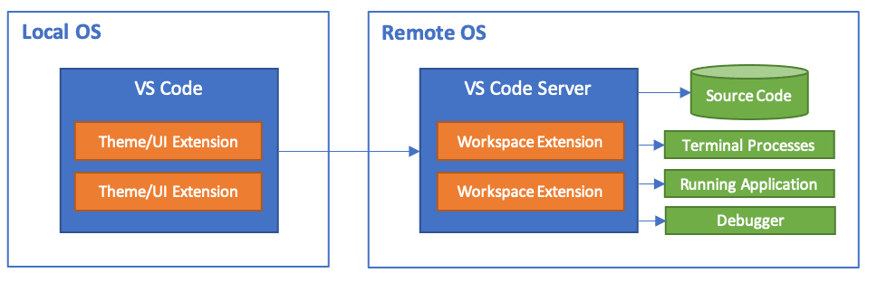

# Visual Studio Code on Princeton HPC clusters

Although [Visual Studio Code (vscode)](https://code.visualstudio.com) was
originally developed by Microsoft it is near platform independent. Meaning, on
whatever devices you work on, you will be able to launch vscode. It now has been
adopted by many users, who have developed a plethora of extensions that make
your coding life a breeze.

In this article, we will focus on a couple of extensions that enable coding on
the the HPC cluster from the comfort of your comfortzone.

1. [Remote Development Extension](#remote-development-extension) [External Docs](https://code.visualstudio.com/docs/remote/remote-overview)
2. [Jupyter Notebooks]() [External Docs](https://code.visualstudio.com/docs/datascience/jupyter-notebooks)

## Remote Development Extension

The Remote Development Extension (RDE) allows the user to access the filesystem
visually from their local machine through SSH. A non-gui vscode-server is
launched on the remote machine that "sends" information from the remote machine
to your local machine.

For the user, this simply means connecting to a host by providing vscode with the needed credentials

_Figure taken from (https://code.visualstudio.com/docs/remote/remote-overview)_